net2blend introduction
================
Julian Evans
30/11/21

-   [Initial set up](#initial-set-up)
-   [Basic network export](#basic-network-export)
-   [Animating networks](#animating-networks)
    -   [Simple example](#simple-example)
    -   [Animating networks of changing
        size](#animating-networks-of-changing-size)
    -   [Animating curved and dashed edges, importing
        folders.](#animating-curved-and-dashed-edges-importing-folders.)
    -   [Using custom vertex objects.](#using-custom-vertex-objects.)
    -   [Arrows](#arrows)
    -   [2d networks in 3d Space](#d-networks-in-3d-space)

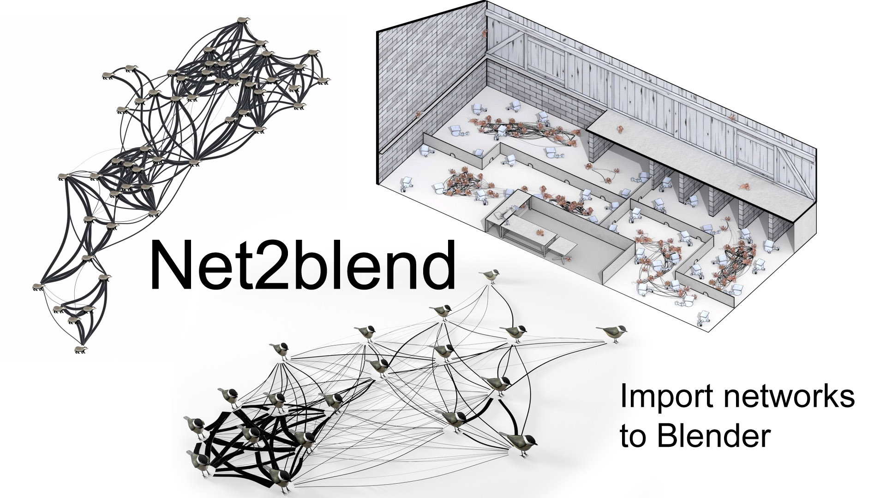

Net2Blend is a way of exporting igraph network objects from R and
importing them into blender, allowing the creation of interesting
visualisations of networks and animations of networks.

# Initial set up

### Blender

Download the import\_network.py file. Follow the instructions
[here](https://docs.blender.org/manual/en/latest/editors/preferences/addons.html)
for how to install Blender addons. If it works, the “import network” tab
should appear (see below).

### R

The R package can either be installed using the binaries provided on the
github repository, or directly using

``` r
devtools::install_github("jevansbio/net2blend",subdir="net2blendR",ref="testing",build_vignettes = T,force = T,quiet = F)
```

We can then load the library. We’ll also load igraph to build our
networks.

``` r
library(igraph)
library(net2blendR)
```

# Basic network export

### R

Here we’ll walk through the most basic export possible.

For this example, we’ll load an artificial network provided with the
package.

``` r
data(examplenet1)
summary(examplenet1)
#> IGRAPH 9632bf4 UN-- 13 21 -- 
#> + attr: name (v/c)
```

This is a simple randomly generated graph. Currently the only attribute
is a name attribute for each vertex. We can now generate a simple circle
layout for this graph.

``` r
l1=as.data.frame(layout_in_circle(examplenet1))
row.names(l1)=V(examplenet1)$name
head(l1)
#>           V1        V2
#> E  1.0000000 0.0000000
#> L  0.8854560 0.4647232
#> M  0.5680647 0.8229839
#> F  0.1205367 0.9927089
#> X -0.3546049 0.9350162
#> N -0.7485107 0.6631227
```

Note that these coordinates are all between -1 and 1. When imported into
Blender these coordinates will be in the scene units, meters by default.
We’ll multiply by 10 to avoid our network being too squashed.

``` r
l1=l1*10
```

We can then export this network using the graph, layout and the default
settings of net2blend. We set the name of the network to be examplenet.

``` r
net2blend(examplenet1,l1,netname="examplenet")
```

This will generate two files. One contains vertex data
“examplenet\_vdata\_0\_.csv” the other edge data
“examplenet\_edata\_0\_.csv”.

### Blender

Open Blender and create a new general scene. Delete the default cube. If
you have installed the net2blend add-on correctly you should find the
“Import network” tab in the side bar (if this is hidden, click the
circled arrow).

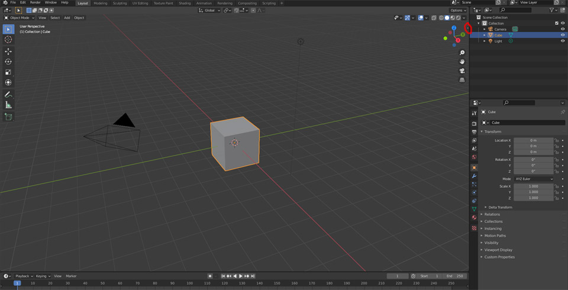

We’ll use the “import single network” tool to import the network. Set
the edge and vertex files and click the import network button. The
network will be imported.

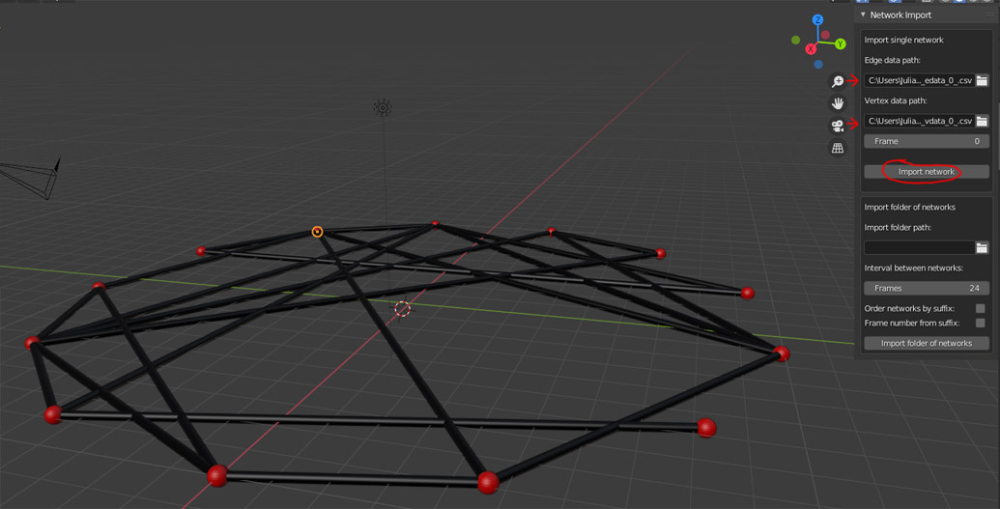

You’ll see that 2 collections have been added to the scene.
“examplenetnodes” (yes I’m sorry, I have been inconsistent in my use of
vertices/nodes) and “examplenetedges”. The vertices and edges are found
within these collections.

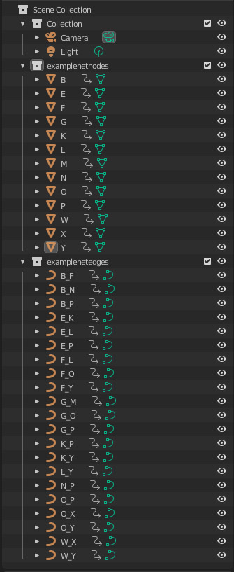

You now have a network as a 3d object in Blender, ready to render!

# Animating networks

We’ll now look at how we can animate these networks in Blender. When you
import a network a [keyframe](https://en.wikipedia.org/wiki/Key_frame)
is automatically added for every vertex and edge. Blender will
interpolate between two keyframes, creating a smooth transition. When we
imported our network in the previous example, the “Frame” argument was
set to 0, meaning keyframes were added at frame 0. If we import another
network with the same edges/vertices

We’ll first add simple animation to the existing network and then look
at how to set up networks to animate edges/vertices appearing and
disappearing.

## Simple example

In this example we’ll add some simple changes to the network in our next
keyframe. We’ll keep the network the same, but change the export
settings.

### R

First we’ll generate a new layout. Once again we multiply everything by
10 to put it on a better scale in blender. Since we are working in 3d
space, lets also move the network up by 10 meters.

``` r
l2=as.data.frame(layout_in_circle(examplenet1))
row.names(l2)=V(examplenet1)$name
l2=l2*10
l2$Z = 10 #adding a Z column
```

we’ll export the network with the new layout and different colour vertex
and edges. Importantly, we keep the same network name “examplenet”. This
means that when we import these files, they will edit the existing
networks, either overwriting existing keyframes (if imported at frame 0)
or adding new keyframes (if added at any other frame). We give it a
different netname2, meaning the filenames will have a different suffix
to distinguish it. The filenames will be “examplenet\_vdata\_2\_.csv”
and “examplenet\_edata\_2\_.csv”.

``` r
net2blend(examplenet1,l2,netname="examplenet",netname2=2,edge.color = "red",vertex.color = "blue")
```

### Blender

In blender, change the edge and vertex data paths to the new files. Set
the frame to 30 and click import.

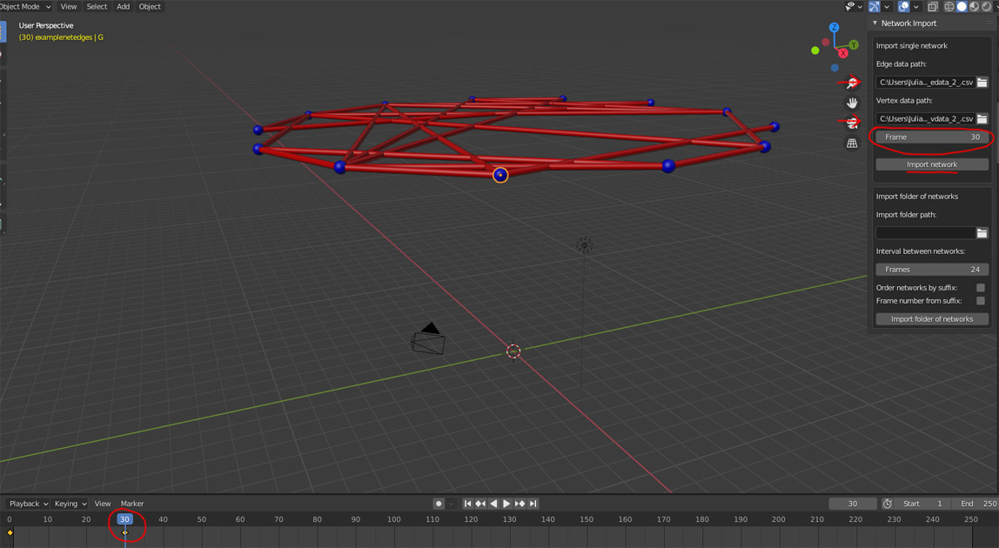

If the network seems to disappear, it is because your current viewpoint
isn’t pulled back enough to see the network’s new Z position. The
current frame on the timeline will be set to 30, where a new keyframe
has been added for every node and edge. You can slide the timeline back
and forth and see the network move and change colour.

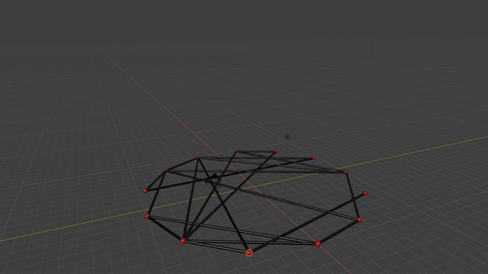

## Animating networks of changing size

Lets consider a more complicated example where the number of edges and
nodes change. This requires us to plan ahead a little when exporting our
keyframes.

### R

In order to animate the networks properly, we need all edges and vertex
from all networks to be **in** every network object, even if they are
not actually **present** in that network. This is because we need to
tell Blender whether or not an edge or a vertex needs to not be present
in a particular timestep.

Start with the two example networks. We will first add attributes to
these networks to indicate that an edge or a vertex is definitely
present.

``` r
data(examplenet1)
data(examplenet2)

#give all these nodes an attribute that they were present
V(examplenet1)$present=T
V(examplenet2)$present=T
#give edges a weight attribute to indicate presence
E(examplenet1)$weight=1
E(examplenet2)$weight=1
```

Examplenet2 is larger than examplenet1, and is missing some of the
vertices from examplenet1. We now need to add all possible edges and
nodes to both of these networks. net2blend has a few convenience
functions for this.

``` r
#find all nodes
allvertex=find_all_vertex(list(examplenet1,examplenet2))

#find all edges
alledges=find_all_edges(list(examplenet1,examplenet2))
```

These functions both take a list of network objects and return all the
vertices and edges. We can then add these to every network. We can add
them with certain attributes, so here we can take advantage of the
“present” vertex attribute we added earlier, setting it to FALSE for all
our new vertices.

``` r
#add nodes to g1 with present attribute set to false
examplenet1=add_missing_vertex(examplenet1,allvertex=allvertex,attrlist=list(present=F))

#If we had nodes disappearing in g2, can run the same line
examplenet2=add_missing_vertex(examplenet2,allvertex=allvertex,attrlist=list(present=F))
```

Similarly, we can add all edges to both networks. Here we set the weight
attribute of all our new edges to zero.

``` r
#add missing edges to g1 and g2 with a weight of 0
examplenet1=add_missing_edges(examplenet1,alledges=alledges,attrlist=list(weight=0))
examplenet2=add_missing_edges(examplenet2,alledges=alledges,attrlist=list(weight=0))
```

Both networks should now have the same number of edges and vertices. We
can also make a few extra changes for the sake of readability.

``` r
#For convenience (not required though) can also match the order of nodes
examplenet1=permute(examplenet1,match(V(examplenet1)$name,sort(V(examplenet1)$name)))
examplenet2=permute(examplenet2,match(V(examplenet2)$name,sort(V(examplenet2)$name)))

#generate edge names for convenience - makes it easier to find the same edges in different graphs
E(examplenet1)$name=get_edge_names(examplenet1)
E(examplenet2)$name=get_edge_names(examplenet2)
```

Finally we need to generate a new layout that fits the full network. For
fun, we can once again add some movement on the Z axis.

``` r
#generate a layout for both networks to use. 
#This will be identical, but we'll add a change in z coordinate in the second frame
l1=as.data.frame(layout_in_circle(examplenet1))
row.names(l1)=V(examplenet1)$name
#add a z coordinate
l1$z=0
#make a copy
l2=l1
#add z components 
l2$z[row.names(l2)%in%V(examplenet1)[present]$name]=-0.5
l2$z[!row.names(l2)%in%V(examplenet1)[present]$name]=0.5

#rescale
l1=l1*10
l2=l2*10
```

We are now ready to export both these networks. We use our “present” and
“weight” attribute to set the size of vertices and edges respectively.

``` r
#export examplenet1
net2blend(examplenet1,layout=l1[match(V(examplenet1)$name,row.names(l1)),],#make sure vertices are matched to their coords
vertex.color="red",
edge.color="black",
edge.size=0.1*E(examplenet1)$weight,#edges of weight 0 will be invisible
vertex.size=0.2*V(examplenet1)$present,#non present nodes will be invisible
netname="example1",
netname2=1)
```

Here you can see I am simply multiplying the desired vertex and edge
size by whether or not the edge or vertex actually exists.

We can also use these attributes to animate other aspects of the network
such as colour.

``` r
#for this example, edges that are present in examplenet1 will become blue in examplenet2 while edges that are disappearing will become red
edgecol=rep("black",length(E(examplenet2)))
edgecol[E(examplenet2)$weight==0]="red"
edgecol[E(examplenet2)$name%in%E(examplenet1)[weight>0]$name&E(examplenet2)$weight>0]="blue"

#similarly new nodes will be green while old nodes will become blue.
nodecol=rep("green",length(V(examplenet2)))
nodecol[V(examplenet2)$name%in%V(examplenet1)[present]$name]="blue"
```

We can now export examplenet2 using these settings

``` r
net2blend(examplenet2,layout=l2[match(V(examplenet2)$name,row.names(l2)),],
vertex.color=nodecol,
edge.color=edgecol,
edge.size=0.1*E(examplenet2)$weight,#edges of weight 0 will be invisible
vertex.size=0.2*V(examplenet2)$present,#non present nodes will be invisible
netname="example1",
netname2=2)#note that netname 2 is different
```

### Blender

Open a new scene and import both networks at different frames:

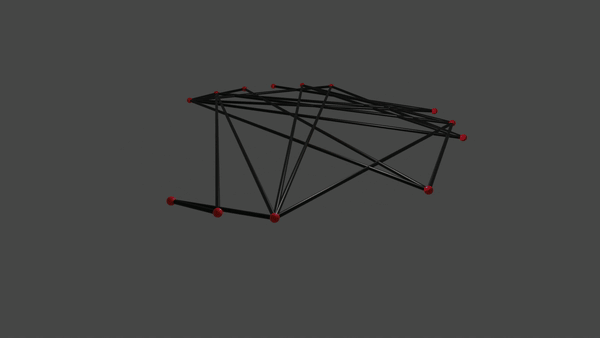

As you can see, edges and nodes now appear and disappear.

## Animating curved and dashed edges, importing folders.

As with edges and vertices disappearing and appearing, a little bit of
forethought is needed to animate curved and dashed edges. If you want to
have an edge curve or become dashed at any point, you need to consider
this in the initial setup.

### R

In order to animate curves and dashes, we export the initial network so
as to set up edges to be curved and dashed, even if they are currently
not. We’ll also save these networks to a folder called example1 and use
netname2 to set frame number. This next code assumes you ran all the
code above so as to make the networks of equal size and set up colours.

``` r
#export examplenet1
net2blend(examplenet1,layout=l1[match(V(examplenet1)$name,row.names(l1)),],#make sure vertices are matched to their coords
vertex.color="red",
edge.color="black",
edge.size=0.1*E(examplenet1)$weight,#edges of weight 0 will be invisible
vertex.size=0.2*V(examplenet1)$present,#non present nodes will be invisible
edge.dash=2,#dash size
edge.isdashed=F,#but no dashes yet.
edge.curve=0,#not curved
edge.forcecurve=T, #but force the edge to allow for curves.
outputdir="example1",
netname="example1",
netname2=0)
```

Using the edge.forcecurve argument force Blender to set up the edges to
allow for curving. Giving a “edge.dash” of greater than 0 OR setting
edge.isdashed to TRUE forces Blender to set up the edge to allow
dashing.

``` r
net2blend(examplenet2,layout=l2[match(V(examplenet2)$name,row.names(l2)),],
vertex.color=nodecol,
edge.color=edgecol,
edge.size=0.1*E(examplenet2)$weight,#edges of weight 0 will be invisible
vertex.size=0.2*V(examplenet2)$present,#non present nodes will be invisible
edge.curve=0,
edge.forcecurve=T, #but force the edge to allow for curves.
edge.dash=2,#dash size
edge.isdashed=T,
outputdir="example1",
netname="example1",
netname2=30)#note that we are setting frames here 

net2blend(examplenet1,layout=l1[match(V(examplenet1)$name,row.names(l1)),],#make sure vertices are matched to their coords
vertex.color="red",
edge.color="black",
edge.size=0.1*E(examplenet1)$weight,#edges of weight 0 will be invisible
vertex.size=0.2*V(examplenet1)$present,#non present nodes will be invisible
edge.curve=2,#edges will curve
edge.forcecurve=T, 
edge.dash=0,#dash size is 0.
edge.isdashed=T,
outputdir="example1",
netname="example1",
netname2=60)
```

We export two more networks, once again sending them to a particular
folder and using netname2 to set the frame number.

We we animate dashes in two different ways. In network 1, dash size is
set to 5, but “isdashed” is set to False. When we move to network 2,
dash size is still 5 but “isdashed” is set to True. This results in the
dashes fading in. When we move to network 3, “isdashed” is still true,
but dash size is set to 0. This results in the dashes increasing in size
until the line becomes solid.

\#\#\#Blender

This time we’ll use the import folder of network function so we don’t
have to import each network individually. Browse to the folder where the
networks were exported. There are now a few options. We can set networks
to be simply ordered by their suffix using the “Order networks by
suffix” button, at a set interval apart as determined by the Frames
option. However, we can also tell Blender to set the frames based on the
suffix, which we will do now, setting our three networks at 0, 30 and 60
frames respectively.

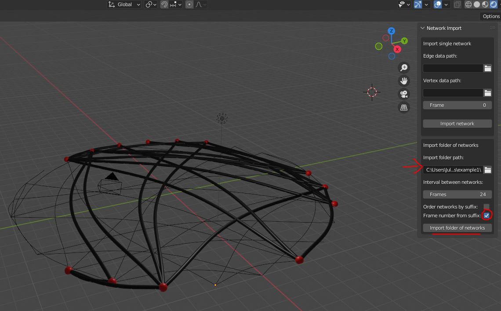

As you can see, the dashes fade in but then scale out.

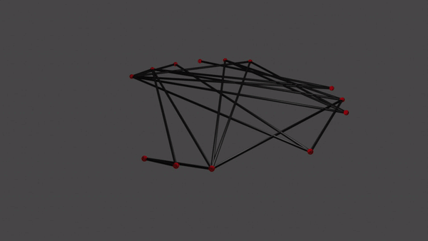

## Using custom vertex objects.

While net2blend can create spheres, cubes, circles and squares, we can
also use any Blender object as a vertex shape allowing some interesting
effects as can be seen in some of the examples above. Doing this is
fairly straightforward.

### Blender

Create a new scene. In this example we’ll use two custom node shapes, a
cylinder and a [“Suzanne” the Blender monkey
head](https://www.quora.com/Why-has-there-been-a-monkey-head-in-the-add-mesh-section-in-every-version-Blender).
You can see that their names are ‘Cylinder and ’Suzanne’ respectively in
the hierarchy. These are the names we need to use them as custom vertex
shapes.

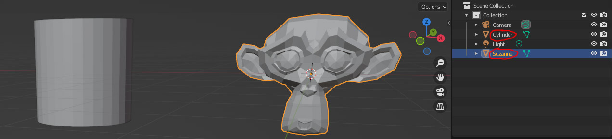

### R

We can now use Suzanne and the cylinder as our vertex shapes. Lets start
with a fresh version of examplenet2

``` r
data(examplenet2)
vertexcolours = rainbow(length(V(examplenet2)))#all the colours of the rainbow for our nodes
```

Now all we have to do is set our vertex.shape to our custom shapes when
exporting. If a custom shape doesn’t have a material in Blender we can
also recolour it.

``` r
net2blend(examplenet2,
vertex.shape=rep(c("Cylinder","Suzanne"),each=13),#set half of the 26 nodes to cylinders, half to monkey heads.
vertex.color=vertexcolours,
edge.color="black",
edge.size=0.1,
vertex.size=0.5,
edge.curve=2,#edges will curve
netname="CustomShapes",
netname2="")
```

### Blender

Return to the Blender scene containing your two custom objects and
import the network we just exported from R.

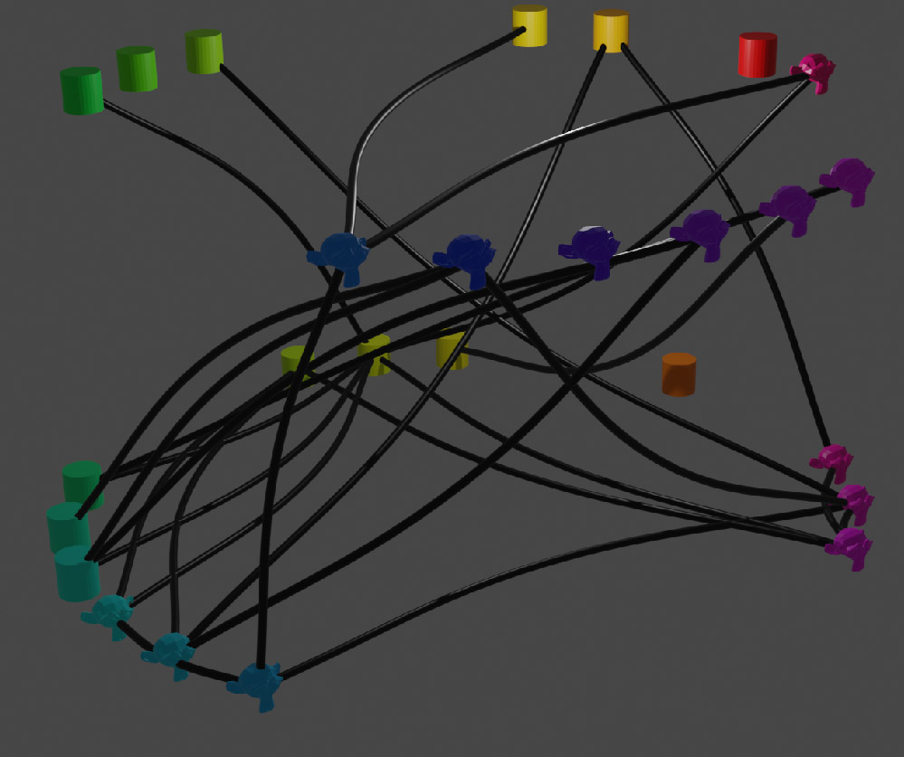

You’ll see that the vertices use the custom objects and as they have no
materials they receive a colour based on our R code.

### R

You may wish to avoid having your edges go all the way into the centre
of your shapes. You can avoid this by setting the “vertex.intersect”
argument to F. You can further control this using the vertex.edgeshorten
argument.

``` r
net2blend(examplenet2,
layout=l2,
vertex.shape=rep(c("Cylinder","Suzanne"),each=13),#set half of the 26 nodes to cylinders, half to monkey heads.
vertex.color=vertexcolours,
edge.color="black",
edge.size=0.1,
vertex.size=0.5,
vertex.intersect = F,
vertex.edgeshorten = 1,
edge.curve=2,#edges will curve
netname="CustomShapes",
netname2="")
```

## Arrows

### R

Arrowheads can be added using edge.arrows and setting edge.arrowsize and
edge.arrowlength. These values can also be animated.

``` r
net2blend(examplenet2,
layout=l2,
vertex.color=vertexcolours,
edge.color="black",
edge.size=0.1,
vertex.size=0.2,
edge.arrows=T,
edge.arrowlength=0.3,
vertex.intersect = F,#giving some space so arrowheads are less likely to clip the vertices
edge.curve=2,#edges will curve
netname="Arrowheads",
netname2="")
```

### Blender

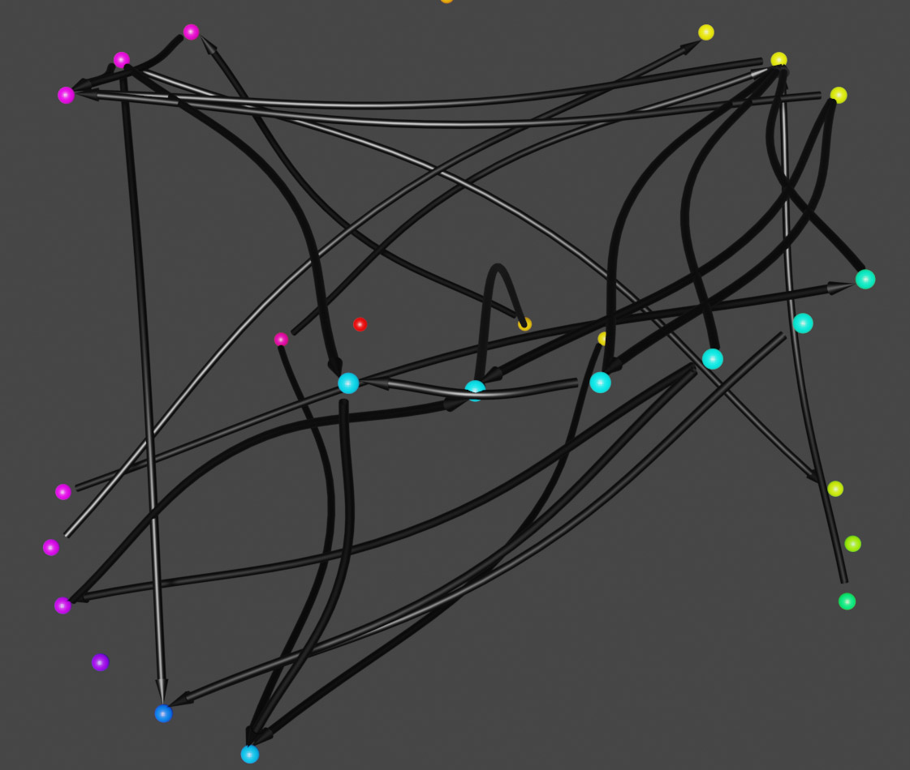

## 2d networks in 3d Space

### R

You can create 2d vertices by setting the vertex shape to “circle” or
“square” and you can create 2d edges by setting edge.3d to FALSE. These
can be combined in a number of different ways to create interesting
effects, as in some of the examples above. In order to assist with the
creation of 2d networks, the zoffset1 and zoffset2 arguments allow the
shifting of 2d edges below the z axis to prevent clipping.

``` r
data(examplenet2)
l1=layout_nicely(examplenet2)
l1=l1*10

net2blend(examplenet2,
layout=l1,
vertex.shape="circle",
vertex.color="blue",
edge.color="black",
edge.size=0.1,
edge.3d=F,
vertex.size=0.5,
zoffset1=0.1,
zoffset2=0.2,
edge.curve=2,#edges will curve
netname="2dnet",
netname2="")
```

### Blender

Here is the above 2d network, with some tweaks to lighting and render
settings.


